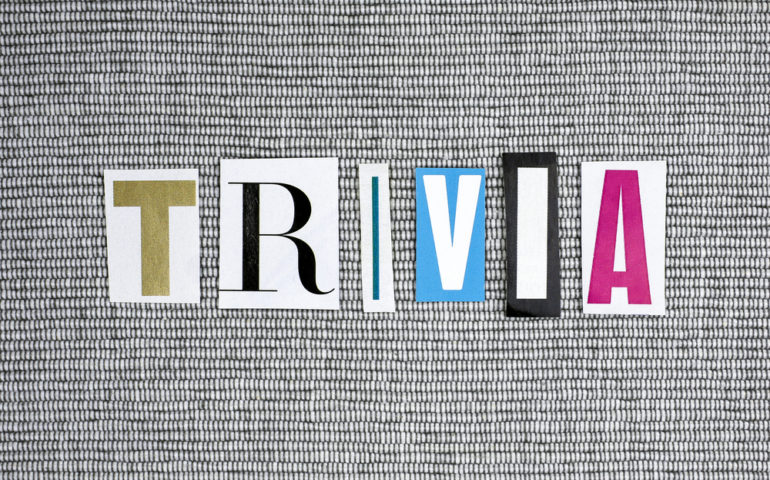

# Timed Trivial Trivia!

## Technology Stack: HTML, CSS, Javascript, jQuery

- This is a trivia game that shows only one question until the player answers it or their time runs out. Players will have 15 seconds to answer each question.

- If the player selects the correct answer, it will congratulate them for choosing the right option. After 3 seconds, the next question will be displayed.

- The scenario is similar for wrong answers and time-outs, except that the correct answer will also be shown.

- There are a total of 9 general knowledge questions, once all questions are answered, the number of correct answers, incorrect answers will be displayed, along with an option to restart the game.
